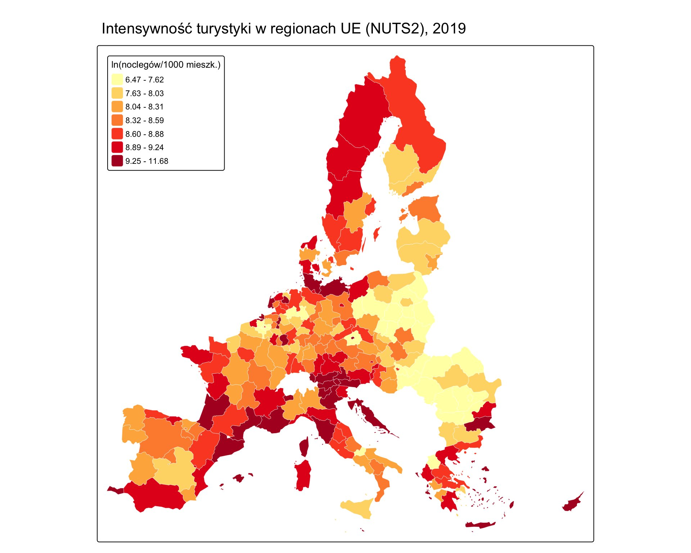
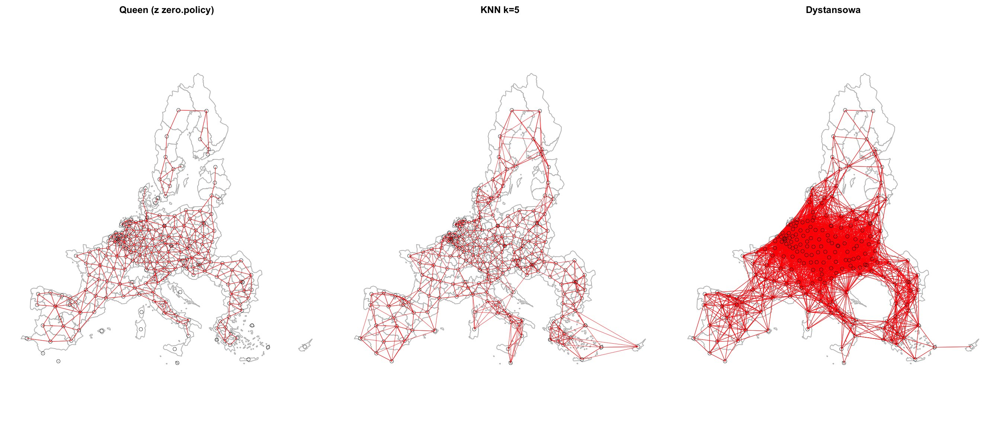
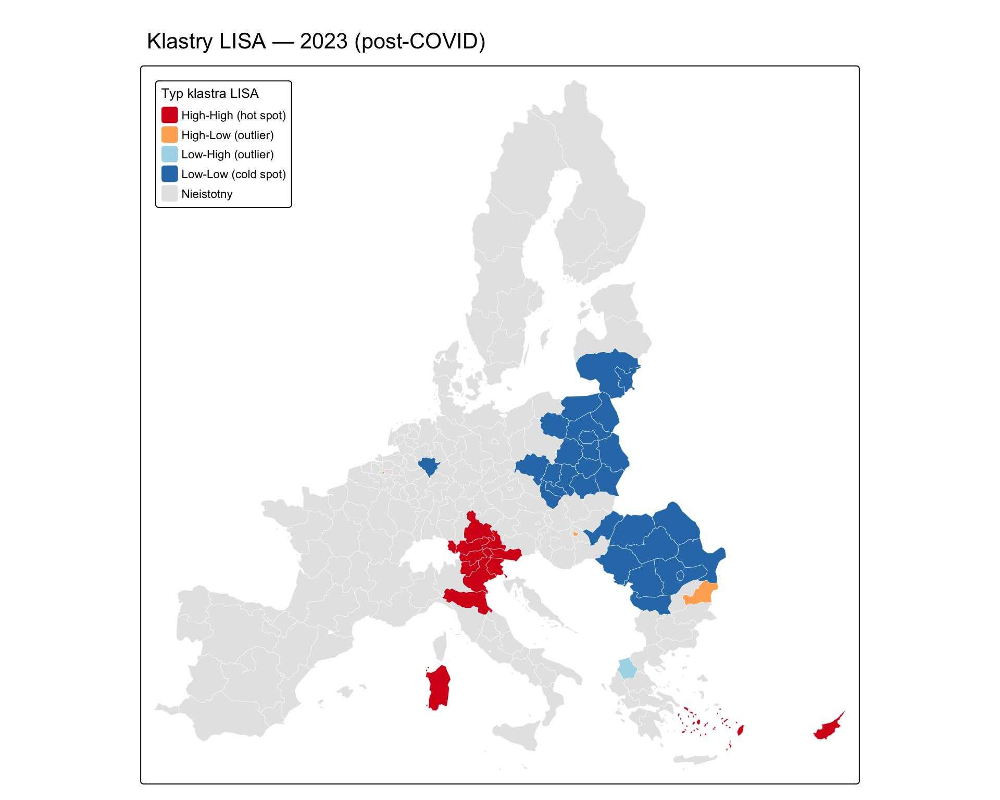
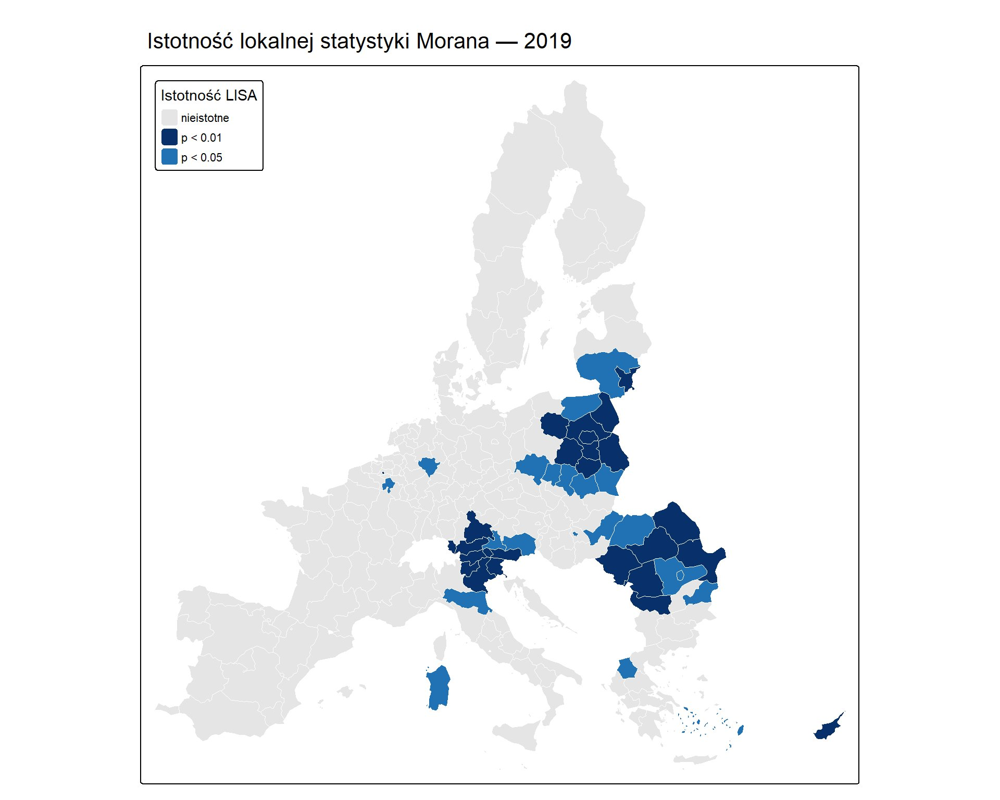
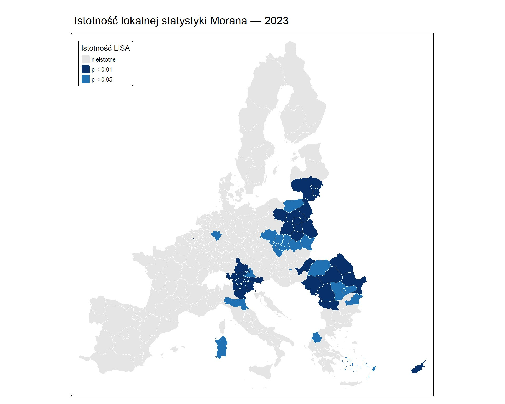
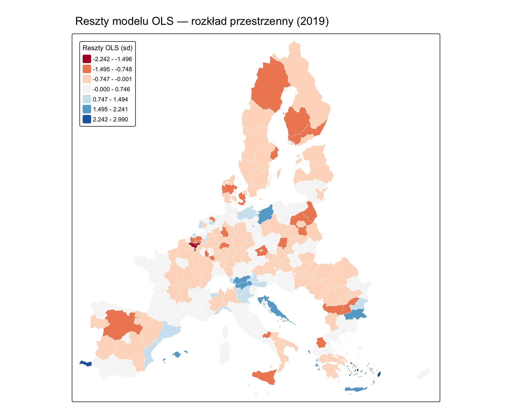

# Intensywność turystyki w regionach NUTS2 Unii Europejskiej (2017–2023)

Projekt z zakresu **ekonometrii przestrzennej (EPS)** analizujący przestrzenne zróżnicowanie i determinanty intensywności turystyki w 220 regionach NUTS2 z 25 krajów Unii Europejskiej w latach 2017–2023, z uwzględnieniem wpływu pandemii COVID-19.

📄 **Pełny raport (HTML):** https://rpubs.com/bartek151122/raport-ekonometria

---

## Cel projektu

Celem analizy jest zbadanie przestrzennej struktury intensywności turystyki w regionach europejskich oraz identyfikacja jej determinant z wykorzystaniem modeli ekonometrii przestrzennej. Projekt odpowiada na trzy pytania:

1. Czy intensywność turystyki wykazuje istotną autokorelację przestrzenną?
2. Jak pandemia COVID-19 wpłynęła na przestrzenny rozkład turystyki w Europie?
3. Jakie czynniki (ekonomiczne, geograficzne, kulturowe) determinują intensywność turystyki i jak silne są efekty rozlewania (spillover) między regionami?

---

## Dane

| Element | Opis |
|---------|------|
| **Jednostki** | 220 regionów NUTS2 |
| **Kraje** | 25 państw UE |
| **Okres** | 2017–2023 (panel zbalansowany, T = 7) |
| **Liczba obserwacji** | 1540 |
| **Zmienna objaśniana** | `ln_nights_per_1000pop` — logarytm liczby noclegów w obiektach zbiorowego zakwaterowania na 1000 mieszkańców |
| **Geometria** | plik `nuts2_final.gpkg`, reprojekcja do EPSG:3035 (ETRS89-LAEA) |

### Zmienne objaśniające i oczekiwane znaki

| Zmienna | Opis | Oczekiwany znak | Uzasadnienie literaturowe |
|---------|------|:---------------:|---------------------------|
| `ln_gdp_pc` | PKB per capita (log) | + | Crouch (1994), Lim (1997) |
| `ln_pop_density` | gęstość zaludnienia (log) | − | Eugenio-Martin i in. (2004) |
| `unesco_count` | liczba obiektów UNESCO | + | Yang i in. (2010), Patuelli i in. (2013) |
| `coast` | dostęp do wybrzeża (0/1) | + | Alegre i Pou (2006) |
| `ln_area_km2` | powierzchnia regionu (log) | − | hipoteza rozproszenia geograficznego |

---

## Metodologia

Analiza przebiega w logicznej sekwencji od eksploracji przestrzennej do modelowania:

1. **Wizualizacja kartograficzna** — mapy choropletowe intensywności turystyki (2019 vs 2023).
2. **Macierze wag przestrzennych** — porównanie trzech specyfikacji: Queen I rzędu, KNN k=5 (główna) i dystansowa.
3. **Globalna statystyka Morana I** — pomiar autokorelacji przestrzennej oraz jej ewolucji w czasie (2017–2023).
4. **Lokalna statystyka Morana (LISA)** — identyfikacja klastrów (hot spots, cold spots, outliery).
5. **Model bazowy OLS** — selekcja zmiennych, diagnostyka multikoliniearności (VIF), testy reszt.
6. **Testy ex-ante** — Pesaran CD, Jarque-Bera, testy LM/Robust LM, testy BSK (Baltagi, Song, Koh 2003).
7. **Estymacja przestrzennych modeli panelowych** — SAR-RE, SDM-RE, SEM-RE (funkcja `spml`).
8. **Weryfikacja ex-post** — testy LR i Walda, wybór modelu finalnego.
9. **Efekty bezpośrednie, pośrednie i całkowite** — dekompozycja wg LeSage i Pace (2009), symulacja Monte Carlo.

---

## Kluczowe wyniki

### Autokorelacja przestrzenna
Globalna statystyka Morana I jest wysoce istotna we wszystkich badanych latach (I w przedziale **0,378–0,427**, p < 0,001 dla macierzy KNN k=5). Intensywność turystyki silnie grupuje się geograficznie.

### Wpływ COVID-19
Autokorelacja przestrzenna osiągnęła **maksimum w 2020 roku (I = 0,427)** — pandemia nie rozłożyła turystyki równomierniej, lecz skoncentrowała ją w tradycyjnych destynacjach. W latach 2022–2023 wartość ustabilizowała się na poziomie ~0,396, zbliżonym do okresu sprzed pandemii.

### Klastry LISA
- **Hot spots:** klaster alpejski (Austria, Tyrol, Bawaria) i śródziemnomorski (Cypr, Sardynia, Wyspy Egejskie).
- **Cold spots:** Polska (praktycznie cały kraj poza wybrzeżem), Rumunia, kraje bałtyckie.
- Struktura przestrzenna pozostaje **wyjątkowo stabilna** między 2019 a 2023.

### Model finalny: SDM-RE (Spatial Durbin Model z efektami losowymi)
Wybrany na podstawie testów ex-ante (Robust LM-SAR), testów BSK oraz testów LR i Walda ex-post. Wszystkie zmienne mają znaki zgodne z oczekiwaniami teoretycznymi.

### Efekty przestrzenne
- Silna autoregresja przestrzenna (λ ≈ 0,7), mnożnik przestrzenny ~3×.
- **Efekty pośrednie (spillover) są ok. 3× większe od bezpośrednich** — co potwierdza silne powiązania europejskich rynków turystycznych.
- Dostęp do wybrzeża i obiekty UNESCO generują wyraźne pozytywne efekty zarówno w regionie, jak i u sąsiadów.

---

## Wybrane wizualizacje

### Intensywność turystyki — 2019 vs 2023
Pas śródziemnomorski i klaster alpejski dominują; struktura przestrzenna pozostaje stabilna mimo pandemii.

| 2019 (pre-COVID) | 2023 (post-COVID) |
|:---:|:---:|
|  |  |

### Macierze wag przestrzennych
Porównanie trzech specyfikacji sąsiedztwa: Queen, KNN k=5 (główna) i dystansowa.



### Klastry LISA — hot spots i cold spots
Czerwony = hot spot (High-High), niebieski = cold spot (Low-Low).

| 2019 (pre-COVID) | 2023 (post-COVID) |
|:---:|:---:|
|  |  |

### Istotność lokalnej statystyki Morana

| 2019 | 2023 |
|:---:|:---:|
|  |  |

### Rozkład przestrzenny reszt modelu OLS
Reszty wykazują autokorelację przestrzenną — uzasadnienie dla modeli przestrzennych.



---

## Struktura repozytorium

```
.
├── raport.Rmd                 # Główny dokument R Markdown z całą analizą
├── panel_final.rds            # Dane panelowe (220 regionów × 7 lat)
├── nuts2_final.gpkg           # Geometria regionów NUTS2
├── gdansk.jpg                 # Grafika tła raportu
├── README.md                  # Ten plik
└── img/                       # Wygenerowane mapy i wykresy (.png)
    ├── mapa_turystyka_2019.png
    ├── mapa_turystyka_2023.png
    ├── lisa_clusters_2019.png
    ├── lisa_clusters_2023.png
    ├── lisa_sig_2019.png
    ├── lisa_sig_2023.png
    ├── macierze_wag.png
    └── ols_residuals_map.png
```

---

## Literatura

- Alegre, J., Pou, L. (2006). *The length of stay in the demand for tourism*. Tourism Management, 27(6), 1343–1355.
- Crouch, G. I. (1994). *The study of international tourism demand: A survey of practice*. Journal of Travel Research, 32(4), 41–55.
- Eugenio-Martin, J. L., Morales, N. M., Scarpa, R. (2004). *Tourism and economic growth in Latin American countries: A panel data approach*. FEEM Working Paper No. 26.
- LeSage, J., Pace, R. K. (2009). *Introduction to Spatial Econometrics*. CRC Press.
- Lim, C. (1997). *Review of international tourism demand models*. Annals of Tourism Research, 24(4), 835–849.
- Paci, R., Marrocu, E. (2013). *Tourism and regional growth in Europe*. Papers in Regional Science, 92(2), 25–50.
- Patuelli, R., Mussoni, M., Candela, G. (2013). *The effects of World Heritage Sites on domestic tourism: A spatial interaction model for Italy*. Journal of Geographical Systems, 15(3), 369–402.
- Yang, C. H., Lin, H. L., Han, C. C. (2010). *Analysis of international tourist arrivals in China: The role of World Heritage Sites*. Tourism Management, 31(6), 827–837.
- Yang, Y., Fik, T. (2014). *Spatial effects in regional tourism growth*. Annals of Tourism Research, 46, 144–162.

---

Projekt edukacyjny przygotowany w ramach przedmiotu Ekonometria Przestrzenna na Politechnice Gdańskiej.
